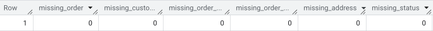

# Customer Segmentation & Retention Analysis Using SQL + Tableau

This project demonstrates customer segmentation using RFM scoring and a detailed retention analysis using SQL (BigQuery) and Tableau.

---

## Datasets Used

- `customer_orders.customer_orders`: Order-level data
- `customer_orders.payments`: Payment-level data

---

## Tasks Completed

### 1. Data Quality Check

Performed null-value checks on both datasets to assess completeness:
- Checked for missing `order_id`, `payment_id`, `order_amount`, `payment_status`, etc in both the tables.
- Result: Neither Customer Order nor Payment table had null values in any of the columns.
  

### 2. Order and Sales Analysis

- Computed total orders and revenue grouped by `order_status`
- View created: `orders_with_date_parts` with pre-extracted `year` and `month`
- Created a **monthly revenue trend** view and used **`DENSE_RANK()`** to identify top 3 revenue-generating months per year. [View Table](ranked_month_by_revenue.png)

### 3. Customer Segmentation (RFM Analysis)

- Built quantile-based RFM segments using:
  - `Recency`: days since last order
  - `Frequency`: orders per active month
  - `Monetary`: total order value
  - [Quantile Table](Diagram/quantile_table.png)
- Created scores from 1 to 5 for each metric and assigned customers to **RFM segments** like:
  Champions, Loyal Customers, Potential Loyalists, At Risk, Hibernating, Lost, etc.
- [Final table:](RFM_SEGMENTATION.csv) `quantile` with segment labels

### 4. Payment Status Analysis

- Analyzed total transactions and revenue grouped by `payment_status`
- Created a **monthly payment trend report** using a view `payments_with_date_parts`
- Used `DENSE_RANK()` on success rates to identify **top 3 months per year** with highest payment success
- Highlighted months with highest payment failures and analyzed status trends
- [Table of Payment Status Dynamics](Diagram/payment_status_dynamics_over_month.png)

### 5. Missing Payments Report

- Created a full joined table of orders and payments using `LEFT JOIN`
- Aggregated missing `payment_id`s across different `order_status`
- Calculated the percentage of missing payments by status  
  **Example:** `"Pending" orders had ~27% missing payments`
- [View Distribution of Missing Payments](Diagram/percentage_of_missing_payments(1).png)  

### 6. Order-Payment Summary Per Customer

- Summarized each customer’s transaction footprint:
  - Total orders, total payment amount, success/failure/pending counts
  - Computed **payment success rate** and **failure rate** per customer
  - [View Distribution of Payment Success Rate at Individual Customer Level](Diagram/payment_success-rate_by-customer(1).png)

### 7. Customer Retention Analysis (Cohort)

The customer retention analysis was fully executed and visualized in Tableau using a cohort-based approach. Tableau's flexible LOD expressions were used to build a dynamic, interactive retention heatmap.

### Tableau Visualization
   **Tableau Logic Breakdown:**
- Customer Cohort Definition

  - Created a calculated field:
    Customer's First Quarter =
    { FIXED [Customer ID] : MIN(DATETRUNC('quarter', [Order Date])) }

  - Converted this field to a dimension and used the second "Quarter" format in Tableau (with year).

- Order Timeline (X-axis)

  - Dragged Order Date to Columns

  - Changed its type to the second "Quarter" format with year.

- Cohort Size Calculation

  - Calculated field:
    - Customers in First Quarter =
    { FIXED [Customer's First Quarter] : COUNTD([Customer ID]) }

    - Used as a dimension and placed in the Tooltip.

- Retention Rate Calculation

  - Calculated field:
    - Retention Rate =
    COUNTD([Customer ID]) / SUM([Customers in First Quarter])

    - Converted to percentage and added to Color and Tooltip.

- Elapsed Time (Optional for Slicing)

  - Calculated field:
    Elapsed Time =
    DATEDIFF('quarter', [Customer's First Quarter], [Order Date])

### **Customer Cohort Retention Heatmap**

.png)

- X-axis: `Elapsed Time` (in months since first order)
- Y-axis: `Cohort Quarter` (customer's first purchase quarter)
- Cell color: `Retention Rate (%)`
  
  **Insights:**
  
  - **Retention drops sharply after initial acquisition :**
    - Across all cohorts, there is a steep drop in retention  from month 0 (100%) to month 1.
    - Example: 2020 Q1 drops from 100% to 7.4% in month 1. This suggests a large portion of users churn immediately after joining.
  - **Long-term retention stabilizes for early cohorts :**
    - Some early cohorts like 2020 Q1 – Q3 and 2021 Q1 – Q3 show consistent retention beyond 12+ months.
    - Example: 2020 Q2 maintains 2.4% even at month 21.
  - **Recent cohorts have not matured yet :**
    - Recent cohorts like 2024 Q2–2025 Q2 show very few data points, as not enough time has elapsed. These rows are sparse, and their long-term retention is yet to be observed.
  - **2022 cohorts show relatively better short-term retention :**
    - Notably, 2022 Q3 and Q4 have higher retention rates in early months (e.g., 10.9%, 11.9%).This might indicate successful campaigns or improvements during that period.
  - **Some cohorts have standout drop-offs :**
    - For instance, 2023 Q2 starts with high initial month-1 retention (7.3%) but rapidly drops to <1% by month 5. This could suggest poor engagement or product issues post-onboarding.
  - **Growth and decline in customer acquisition :**
    - The number of customers in each cohort is shown in the second column.Peak acquisition was in 2020 Q1 (676 customers). Numbers generally trend downward in later quarters (e.g., 2025 Q2 only has 39).This could indicate declining user acquisition or narrowing target markets.

### ***Business Suggestions Based on Payment Behavior & RFM Segmentation***
- **Support Customers with High Payment Failures**
Some customers exhibit high rates of missed or failed payments, which can affect both cash flow and customer experience. The company should:

  - Introduce automated payment reminders and retry mechanisms.

  - Provide clearer communication on payment deadlines or issues.

  - Investigate and resolve payment gateway frictions.

- **Recognize and Reward High Success-Rate Customers**
Customers who consistently complete payments successfully are low-risk and potentially high-value.

  - Prioritize these users for loyalty programs or upgrades.

  - Offer referral bonuses to leverage their positive experience.

Use their behavior patterns to train recommendation models or flag ideal profiles.

- **Enhance Recovery Campaigns Using RFM Tags**
RFM segmentation reveals dormant and at-risk segments.

  - Customers in “At Risk” or “Hibernating” segments can be targeted with reactivation offers.

  - “Can’t Lose Them” or “Loyal” customers showing recent payment issues need urgent attention.

- **Cross-Analyze Payment Data with RFM to Detect Key Shifts**
A powerful next step would be to combine the payment behavior with RFM tags:

  - Spot loyal customers whose payment behavior is now declining — a potential early warning for churn.

  - Detect formerly inactive users who are now paying regularly — opportunities for upselling or engagement.

---
