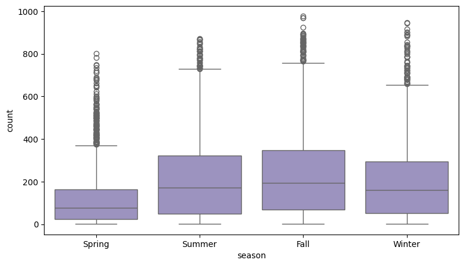

#  Hypotheis Testing and Exploratory Data Analysis on YULU Bike Share Demand
- **Objective**: Investigate factors affecting number of rides in the Yulu bike-sharing dataset and perform hypothesis testing to identify statistically significant variables.
- **Skills Used**:
  - Exploratory Data Analysis
  - Hypothesis Testing (Z-test, T-test, ANOVA)
  - Outlier detection, distribution analysis
- **Data Processing & Exploratory Analysis :** 
  To make the dataset more interpretable and analysis-ready, I first restructured the raw datetime column by separating it into distinct date and time features.      This enabled both monthly and hourly trend analyses. 
  The original dataset used numeric or binary codes for several categorical variables like season, holiday, and working day. I transformed these into more
  intuitive labels:
    - Season codes were relabeled as Spring, Summer, Fall, and Winter.
    - For holiday and working day, I combined the two binary flags to create a new feature: day_type, classifying each day as a Weekday, Weekend, or Holiday based        on its logic.
- **Rental Trends Across Months (2011–2012) :** 

  
  
  By aggregating the data month-wise, I observed a clear seasonal pattern:
  - Ride counts consistently dip in January and peak mid-year, aligning with seasonal behavior.
  - The drop in January 2011 was more severe than in January 2012, and the peak in June 2012 was notably higher than June 2011.

  This suggests a recovery and growth in rental activity across the two years.

- **Growth in User Segments :** 

  Analyzing the two user types over time:
  
  -Registered user rides increased by 70.43% from 2011 to 2012.
  -Casual user rides increased by 51.66% during the same period.
  -The faster growth in registered users suggests increasing brand loyalty or adoption of subscription-based access over time.
  
 - **Correlation Pattern:**  
  
    $~~~~~~~~~~~~~~~~$  
    
    From scatter plot: 
    - Observed a linear correlation between registered users and count, especially on weekdays.
    - This validates that registered users are primary contributors to weekday usage spikes.

- **Daily Usage Behavior :** 

  
  
  Plotting ride counts across the 24-hour clock revealed a bimodal distribution:
  
  - Morning peak at 8 AM
  - Evening peaks at 5–6 PM

  These patterns align with commute hours, highlighting that a major share of users leverage Yulu as a transport alternative for work or school during rush hours.
  
- **Outlier Detection & Statistical Analysis:**  

  **Unusual Weather & Human Behavior**  
  - Interestingly, 158 registered and 6 casual users rented bikes during heavy rain, ice-pellets, thunderstorms, and mist — exclusively on weekdays.
  This suggests certain user segments are highly commute-driven, even in extreme weather.

  **Outlier Detection:**  
  
  Visual analysis (boxplots and scatter plots) indicated the presence of outliers in columns like windspeed, count, casual, and registered. 
  Applied Z-score based outlier detection:
  - Windspeed column has 67 outliers (0.62%)
  - Count column has 147 outliers (1.35%)
  - Registered column has 235 outliers (2.16%) 
  - Casual has 292 outliers (2.68%)
  These outliers were retained in the dataset for further analysis, as they may represent genuine extreme cases (e.g., weather anomalies). 
  
  **Seasonal Impact on Ride Count:**   
  - Boxplot comparisons revealed significant variance differences across seasons — especially between Spring/Winter vs Summer/Fall. 
  
  
  
  - To avoid assuming equal variances, used Kruskal-Wallis Test (a non-parametric alternative to ANOVA):
    - P-value: 2.48e-151
    - Strong evidence that ride count varies significantly across seasons

  **Comparing Summer vs Fall:**  
  
    To check if ride behavior differs between Summer and Fall, tested variance first:
    - Levene’s Test P-value: 0.2505 --> Variance is similar
    - Proceeded with T-Test for mean difference:
      - T-Test P-value: 0.00027 --> Strong evidence that mean ride counts differ significantly between Summer and Fall
  
  **Impact of Day Type on Ride Demand:**
    - **Variance Check Across Day Types:**
    - Boxplots for Weekdays, Weekends, and Holidays showed visually similar spread in ride counts.
    - Confirmed using Levene’s Test:
      -  P-value: 0.997 --> Variances are statistically the same (homogeneity in variance holds) so moved forward with ANOVA test.
      - Proceeded with One-Way ANOVA to compare mean ride counts across day types.
        - ANOVA P-value: High(0.4641949837127587)
        - Failed to reject the null hypothesis. 
    **Conclusion:** No statistically significant difference in ride demand across Weekdays, Weekends, and Holidays.

- **Key Insights**:
  - Duration of ride is dependent on time of day
  - Significant differences exist across user types and locations
  - Actionable suggestions for optimizing user engagement and fleet placement
